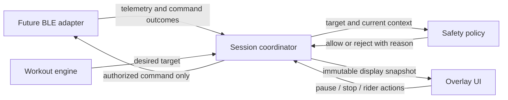

# Architecture

## Status and goal

This is a scaffold, not a functioning bike controller. Only the static launch
screen exists. All behavior below is a design contract for future implementation.
The target is the Echelon EX-5s 22-inch console, subject to hardware validation.
Reliability and rider control take priority over automatic workout completion.

## Boundaries and dependency direction

| Module | Responsibility | Dependencies |
| --- | --- | --- |
| `app` | Composition, activity, future service/session coordinator, permissions | Core modules and overlay |
| `core/bike` | Telemetry, capabilities, connection and command contracts | Kotlin/JVM only |
| `core/workout` | Workout definitions, elapsed time, interval state, desired targets | Kotlin/JVM only |
| `core/safety` | Pure authorization decisions, limits, fault and arming state | Kotlin/JVM only |
| `feature/overlay` | Android window rendering and rider action callbacks | Android; no core module dependencies |
| `data/bike-ble` (future) | GATT lifecycle, protocol codec, serialized I/O | Android and `core/bike` |

The coordinator maps bike samples and workout intents into safety inputs and maps
session state into overlay snapshots. These mappings keep the pure modules and
presentation independent. Avoid introducing shared types until a concrete
contract requires them. No production BLE adapter or service exists yet.

## Bike communication

First establish actual protocol and console capabilities. Do not assume FTMS or
compatibility from the Echelon model name. Future BLE work must separate packet
decoding from Android transport. The bike contract exposes connection state,
capabilities, cadence in rpm, power in watts, speed in m/s, and resistance in
validated device levels. Values include validity and monotonic reception time;
unknown data remains unavailable and derived values are labeled as estimates.

Use one connection owner and a bounded, serialized command path. Keep requested
resistance separate from confirmed observations. A completed GATT write is not
proof of physical actuation. Define confirmation from verified protocol evidence.
Old connection callbacks and queued targets must not affect a new session.

## Workout and safety flow

The workout engine consumes definitions and injected monotonic time. It produces
interval state and target intents, independent of device I/O. Model idle, running,
paused, completed, and aborted states explicitly. Never advance paused intervals
using wall-clock time or UI redraw frequency.

The safety policy evaluates each target against rider arming, current connection,
fresh valid telemetry, known bounds, allowed rate of change, and outstanding
command state. Until these inputs and limits are verified, reject automatic
control. Use a single serialized coordinator to process telemetry, timer events,
manual actions, and command results. Revalidate immediately before dispatch so a
queued approval cannot survive stop, stale data, or a connection change.

| Event | Required future response |
| --- | --- |
| Fresh launch or restored process | Disarmed; no automatic writes |
| Explicit arm with verified prerequisites | Permit bounded automatic targets |
| Pause, stop, workout completion, or manual override | Cancel pending automatic targets; disarm |
| Stale/invalid data, disconnect, or command timeout | Inhibit writes, pause progression, expose fault |
| Reconnect or fault recovery | Clear old queue; require explicit rider re-arm |
| Overlay revoked | Remove window; retain notification stop and visible session state |
| Required Bluetooth permission lost | Disarm, cancel pending work, release connection |

Stop cannot retract a command already transmitted. Do not promise a physical
emergency stop or a resistance reduction after connectivity loss. Do not send a
blind minimum-resistance command as a fallback. Exact stale-data timeouts,
resistance limits, ramp rates, and confirmation rules remain unresolved until
supervised device validation. Manual bike controls must remain available.

## Android lifetime and video coexistence

A future user-started foreground service owns the session and BLE connection;
activities and overlay windows are observers. The service has a persistent
notification with pause/stop actions. Launch it from an allowed user interaction,
with the foreground-service type and permissions appropriate to the verified
Android/API level. Avoid work tied to an activity, unbounded wake locks, and
periodic background jobs for live control.

Request Bluetooth and overlay access only at the feature entry point, explain
their purpose, and handle denial/revocation. A future overlay uses
`TYPE_APPLICATION_OVERLAY` with user-granted draw-over-other-apps access. The
current manifest requests none of these capabilities. API 26 is provisional;
confirm the console OS before committing to a support range.

Netflix, Prime Video, and YouTube remain independent foreground apps. Do not use
accessibility automation, media capture, or modify them. They or the console OS
may suppress overlays; coexistence cannot be guaranteed by this design. Verify
installation, overlay visibility/touch behavior, background execution, competing
BLE ownership, and thermal/resource behavior on the actual console.

Persist workout definitions and optional progress for recovery, never an armed
state or pending command queue. After process loss, restore a paused/disarmed
session requiring rider confirmation. Android may kill the process, so neither a
foreground service nor an overlay constitutes a hardware safety mechanism.

## Test strategy

Start with JVM tests for pure workout and safety logic using a fake monotonic
clock. A fake bike must script missing/invalid samples, disconnects, late callbacks,
timeouts, and unconfirmed commands. Verify that no command can pass after stop or
across session changes. Use invariants such as no writes while disarmed, no writes
outside verified bounds, and at most one command in flight.

Android integration tests cover service start/stop, notification actions, activity
recreation, permission denial/revocation, overlay dismissal, and process restart.
Run simulated sessions before implementing BLE. Later add codec fixture tests
from documented protocol observations, followed by supervised real-bike checks.
No initial automated tests exist because no domain behavior is implemented.

## Platform references

- [AGP 8.13 build requirements](https://developer.android.com/build/releases/agp-8-13-0-release-notes)
- [Foreground services](https://developer.android.com/develop/background-work/services/fgs)
- [Bluetooth permissions](https://developer.android.com/develop/connectivity/bluetooth/bt-permissions)
- [Application overlay windows](https://developer.android.com/reference/android/view/WindowManager.LayoutParams#TYPE_APPLICATION_OVERLAY)

Recheck platform requirements when implementing these features and record results
for the console's actual OS and firmware.
